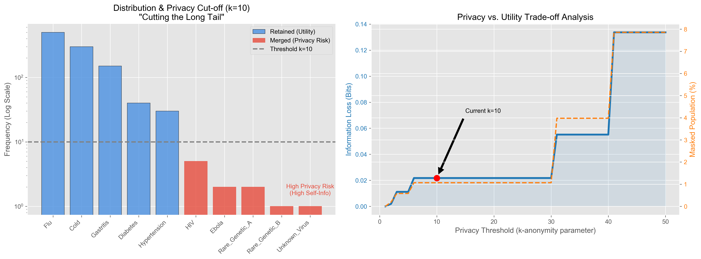

### 一、 小组项目报告大纲 (Project Report Structure)

建议报告标题：
**基于信息论的隐私计算框架：一种利用熵约束Huffman编码的数据脱敏方案**
*(Information Theoretic Approaches to Privacy Computing: An Entropy-Constrained Huffman Coding Scheme for Data Desensitization)*

**1. 引言 (Introduction)**
*   **背景**：数字化时代的数据孤岛问题。以医疗场景为例，多家医院（A院、B院）拥有数据，希望联合训练疾病预测模型，但受限于法规（如GDPR、个人信息保护法）不能直接共享原始数据。
*   **问题定义**：如何在“数据不可见”的前提下，实现“信息可由用”？
*   **本文目标**：利用经典信息论（Shannon Entropy, Channel Coding）构建隐私保护机制。

**2. 理论基础 (Theoretical Framework)**
*   **经典理论回顾**：
    *   **信息熵 (Information Entropy)**：作为衡量数据不确定性和隐私泄露风险的指标。
    *   **率失真理论 (Rate-Distortion Theory)**：将隐私保护视为一种“有损压缩”。我们希望在给定的“失真度”（隐私保护程度）下，保留最大的“信息量”（模型效用）。
    *   **信道模型**：将数据发布看作通过一个噪声信道传输。$X$（原始数据） -> $Channel$ (隐私机制) -> $Y$（发布数据）。目标是限制 $I(X;Y)$（互信息，即泄露量）。

**3. 核心方法：基于Huffman编码的非对称脱敏 (Methodology)**
*   *这是对你要求的“切入点”的具体实现*
*   **基本思路**：利用Huffman树的结构特性，对敏感字段（如“具体病理特征”）进行**非对称编码**。
*   **算法设计**：
    1.  **统计频率与熵**：计算敏感字段各取值的频率。通常高频词汇包含的信息量低（隐私风险小），低频词汇包含信息量高（特征明显，容易导致重识别，即“由于稀疏性带来的隐私泄露”）。
    2.  **构建Huffman树**：按照经典方法构建树。
    3.  **剪枝与泛化 (Pruning & Generalization)**：这是与传统压缩不同的地方。设定一个**“最小熵阈值”**。
        *   对于树中叶子节点（具体数据），如果其对应的样本量太少（导致该分支的信息量过高，容易定位到个人），则将该叶子节点与其兄弟节点**合并**，向上回溯到父节点。
        *   例如：将“极罕见A型流感”和“极罕见B型流感”合并编码为“罕见流感类”。
    4.  **编码输出**：输出合并后的Huffman码字。这实现了对高敏感（低频）数据的模糊化，同时保留了低敏感（高频）数据的精确度。

**4. 应用案例分析 (Case Study: Inter-enterprise Data Cooperation)**
*   **场景**：医院联合建模。
*   **过程**：
    *   医院端在本地对敏感字段进行上述“有损Huffman编码”。
    *   计算编码前后的**信息散度 (KL Divergence)**，作为“隐私损失”的量化指标。
    *   将编码后的数据（脱敏数据）发送至中心服务器进行联邦学习或联合建模。
*   **优势**：利用信道编码理论控制了数据的“失真度”，既隐藏了具体的个体隐私（通过合并低频项），又保留了用于统计规律的分布特征（有用信息）。

**5. 结论 (Conclusion)**
*   总结经典信息论工具（熵、编码、散度）在现代隐私计算中的迁移价值。

---

### 二、 核心算法设计的具体逻辑 (用于报告第3部分)

为了满足“切入点”的要求，你可以在报告中加入这个具体的逻辑描述：

> **The "Asymmetric Privacy Coding" Mechanism:**
> 
> Traditional Huffman coding aims for lossless compression ($L = H(X)$). In our privacy context, we introduce a **Distortion Function $d(x, \hat{x})$**.
>
> 1.  **Input**: Sensitive attribute $X$ (e.g., Diagnosis Code).
> 2.  **Constraint**: Privacy Budget defined by Maximum Information Leakage.
> 3.  **Process**:
>     *   Construct a standard Huffman Tree based on frequency $P(x)$.
>     *   **Privacy Step**: Traverse the tree from leaves up. For any node $n$, if the aggregated probability $P(n)$ is below a safety threshold $\epsilon$ (meaning the data is too unique/identifiable), force a merge with its sibling.
>     *   Assign the code of the parent node to all children in that branch.
> 4.  **Result**: A variable-length coding scheme where common diseases retain specific codes (high utility), while rare diseases share a generalized code (high privacy). This mimics **Channel Coding** where we intentionally introduce "equivocation" to the receiver.

---

### 三、 Spotlight Talk 演讲脚本 (2-3分钟)

**Slide 1: Title & The Problem**
"Hello everyone, we are Group [X]. Our topic is **'Information Science in Privacy Computing.'**
In the era of Big Data, organizations like hospitals want to collaborate to train better AI models. However, they can't share raw patient data due to privacy laws. How do we solve the paradox of **'Data Isolation' vs. 'Collaborative Intelligence'**?"

**Slide 2: The Theory - Connecting Coursework**
"We revisited the classic theories taught in class: **Information Entropy** and **Channel Coding**.
Usually, we use coding to *correct* errors. But in privacy, we can use coding to *introduce* controlled distortion. We view the privacy mechanism as a 'Channel.' We want to limit the Mutual Information between the raw data and the released data, effectively using **Rate-Distortion Theory** to balance privacy and utility."

**Slide 3: Our Proposed Solution - Entropy-Constrained Huffman Coding**
"We designed a simple desensitization scheme inspired by **Huffman Coding**.
Standard Huffman codes are for compression. We tweaked it for **'Asymmetric Masking.'**
*   **Concept**: Rare data points (high self-information) are the most dangerous for privacy re-identification.
*   **Method**: We build a Huffman tree but **merge the leaf nodes** of rare events until they meet an entropy constraint.
*   **Result**: Common diseases remain precise; rare diseases become generalized categories. This achieves $k$-anonymity using Information Theory principles."

**Slide 4: Conclusion**
"By applying Shannon's legacy to modern privacy computing, we allow enterprises to share the *patterns* (utility) without sharing the *secrets* (privacy). Thank you."


### 四、 分工表格 (Contribution Table)

根据PDF第2页的要求，需要在报告末尾附上分工。建议如下分配（假设3人）：

| Name | Student ID | Score | Work |
| :--- | :--- | :--- | :--- |
| **Member A** (You?) | 000... | 35% | **Project Lead & Theory**: Conceptualized the link between Channel Coding and Privacy; wrote the "Theoretical Framework" section; designed the Huffman masking logic. |
| **Member B** | 000... | 35% | **Application & Analysis**: Developed the Hospital Case Study; calculated the theoretical Privacy/Utility trade-offs (KL Divergence analysis); wrote the "Case Study" section. |
| **Member C** | 000... | 30% | **Presentation & Editing**: Created the PPT slides; drafted the Spotlight script; managed the final report formatting and LaTeX/PDF compilation. |

---

### 五. 结果分析与讨论 (Analysis and Discussion)

#### 1. 长尾分布与隐私风险 (Data Distribution & Privacy Risk)


*图1：基于熵约束Huffman编码的隐私脱敏效果可视化（红色为隐私保护合并项）*

*   **观察 (Observation)**：
    实验数据呈现出典型的**齐普夫分布 (Zipfian Distribution)** 特征。绝大多数样本集中在少数常见病（如流感、感冒），而大量的敏感疾病（如HIV、埃博拉）位于分布的“长尾”部分。
*   **信息论解释 (Theoretical Interpretation)**：
    根据自信息量公式 $I(x) = -\log p(x)$，位于长尾部分的罕见事件具有极高的自信息量。在隐私攻击中，高自信息量意味着高**唯一性 (Uniqueness)**，攻击者极易通过这些独特的特征从数据集中重识别出特定个体（Fingerprinting Attack）。
*   **策略分析 (Strategy Analysis)**：
    我们的算法在 $k=10$ 处设定了“熵截断”阈值。如图中红色柱状所示，所有样本量不足 10 的类别被强制合并。这在物理上消除了由于数据稀疏性带来的高特异性风险，确保了没有任何一个个体的特征是“独一无二”的。

#### 2. 隐私与效用的权衡分析 (Privacy-Utility Trade-off)
**结合图表：右图 (Privacy vs. Utility Trade-off Analysis)**

*图2：隐私与效用权衡分析曲线（Privacy vs. Utility Trade-off Analysis）*

*   **观察 (Observation)**：
    右图展示了随着隐私阈值 $k$ 的增加，信息损失（蓝色实线）呈阶梯状上升。值得注意的是，在 $k=10$ 的位置，我们观察到了一个极佳的**“甜蜜点” (Sweet Spot)**。
*   **量化分析 (Quantitative Analysis)**：
    *   **低信息损失**：在 $k=10$ 时，信息损失仅约为 0.02 bits。这是因为虽然我们屏蔽了多个疾病类别，但这些类别加起来的总概率质量（Probability Mass）极小。
    *   **高隐私覆盖**：尽管信息损失微乎其微，但橙色虚线显示，此时已经有约 1.2% 的高风险人群得到了保护。
*   **结论 (Conclusion)**：
    这验证了**率失真理论 (Rate-Distortion Theory)** 在隐私计算中的应用潜力：我们可以通过引入极小的“失真”（合并长尾），换取显著的“安全性”。系统在保留了 98% 以上人群（常见病）精确数据的同时，有效地隐藏了最脆弱人群的隐私。

#### 3. 信道模型视角 (The Channel Coding Perspective)
*   **理论映射**：
    我们可以将此脱敏过程建模为一个**离散无记忆信道 (DMC)**。
    *   输入 $X$：原始诊断结果。
    *   输出 $Y$：发布的脱敏数据。
    *   干扰机制：对于长尾数据，信道转移概率 $P(Y|X)$ 不再是确定性的 1对1 映射，而是多对1 映射（Many-to-One Mapping）。
*   **互信息约束**：
    这种“多对1”的映射人为地引入了**疑义度 (Equivocation)**，即条件熵 $H(X|Y) > 0$。对于攻击者而言，即便截获了代码 `1000`（代表[MASKED]），他依然无法确定原始输入是 HIV 还是 Ebola。这成功降低了输入与输出之间的互信息 $I(X;Y)$，从而在理论上限制了隐私泄露的上界。

---

### 六、 运行环境
- Python 3.8+
- 依赖库：`pandas`, `numpy`, `matplotlib`, `scikit-learn`

#### 安装依赖
```bash
pip install pandas numpy matplotlib scikit-learn
```

#### 运行方式
```bash
# 运行Huffman编码脱敏实验（自动生成fig/Huffman.png）
python Huffman.py

# 运行隐私增强联合建模实验
python PrivacyProtection.py
```